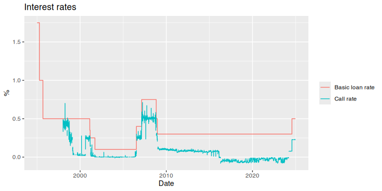

BOJfame
================

The `BOJfame` package provides an `R` interface to the Bank of Japan’s
[Time-Series Data
Search](https://www.stat-search.boj.or.jp/index_en.html) portal.
Specifically, it allows users to download individual series codes
directly from within R using exact series codes.

The name derives from the “famecgi2” script underpinning the BOJ’s
database system; most likely this is a reference to the
[FAME](https://en.wikipedia.org/wiki/FAME_(database)) database tool.

## Install package

The package can be installed from Github.

``` r
library(devtools)
install_github("stefanangrick/BOJfame")  # GitHub
```

## Example usage

To import data, first load the package.

``` r
library("BOJfame")
```

Next, we run the `get_bojfame()` function to download two data series.
Note that data series need to be of the same frequency, otherwise an
error is returned. In the example below, we download two daily-frequency
time series. We use `start_year` and `end_year` to specify the desired
date range.

``` r
bojdata <- get_bojfame(series_codes = c("FM01'STRDCLUCON", "IR01'MADR1Z@D"),
                       start_year = 1995, end_year = 2022)
```

The `get_bojfame()` function returns a list with a
[tibble](https://tibble.tidyverse.org/) data frame holding the actual
data. Access the data using `$data` variable.

``` r
bojdata$data
```

    ## # A tibble: 20,454 × 3
    ##    date       indicator       obs_value
    ##    <date>     <chr>               <dbl>
    ##  1 1995-01-01 FM01'STRDCLUCON     NA   
    ##  2 1995-01-01 IR01'MADR1Z@D        1.75
    ##  3 1995-01-02 FM01'STRDCLUCON     NA   
    ##  4 1995-01-02 IR01'MADR1Z@D        1.75
    ##  5 1995-01-03 FM01'STRDCLUCON     NA   
    ##  6 1995-01-03 IR01'MADR1Z@D        1.75
    ##  7 1995-01-04 FM01'STRDCLUCON     NA   
    ##  8 1995-01-04 IR01'MADR1Z@D        1.75
    ##  9 1995-01-05 FM01'STRDCLUCON     NA   
    ## 10 1995-01-05 IR01'MADR1Z@D        1.75
    ## # … with 20,444 more rows

Use `$meta` to access a [tibble](https://tibble.tidyverse.org/) data
frame holding relevant meta data.

``` r
bojdata$meta
```

    ## # A tibble: 9 × 3
    ##   Attribute            `FM01'STRDCLUCON`                                 IR01'…¹
    ##   <chr>                <chr>                                             <chr>  
    ## 1 Series code          FM01'STRDCLUCON                                   IR01'M…
    ## 2 Name of time-series  Call Rate, Uncollateralized Overnight, Average (… The Ba…
    ## 3 Unit                 percent per annum                                 Percen…
    ## 4 Statistical category Call Rate                                         The Ba…
    ## 5 Observation          AVERAGED                                          END    
    ## 6 start of time-series 1998/01/05                                        1882/1…
    ## 7 End of time-series   2022/12/26                                        2022/1…
    ## 8 Frequency            DAILY                                             DAILY  
    ## 9 Notes                <NA>                                              <NA>   
    ## # … with abbreviated variable name ¹​`IR01'MADR1Z@D`

To plot the data using [ggplot2](https://ggplot2.tidyverse.org), run the
below.

``` r
library("dplyr")
library("ggplot2")

bojdata$data <- mutate(bojdata$data,
                       indicator = recode(indicator,
                                          "FM01'STRDCLUCON" = "Call rate",
                                          "IR01'MADR1Z@D" = "Basic loan rate"))

ggplot(bojdata$data, aes(x = date, y = obs_value)) +
  geom_line(aes(colour = indicator)) +
  labs(title = "Interest rates", x = "Date", y = "%") +
  theme(legend.title = element_blank())
```

<!-- -->

Note that BOJ data sets come with a number of different time formats.
The [zoo](https://cran.r-project.org/package=zoo) package
(e.g. `as.yearmon()`) should be able to parse most formats.

## Note

This package is in no way officially related to or endorsed by the [Bank
of Japan](https://www.boj.or.jp/). Please don’t abuse the BOJ’s servers
with unnecessary calls.
